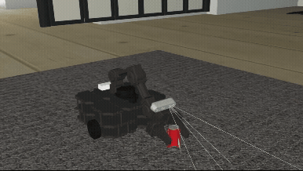
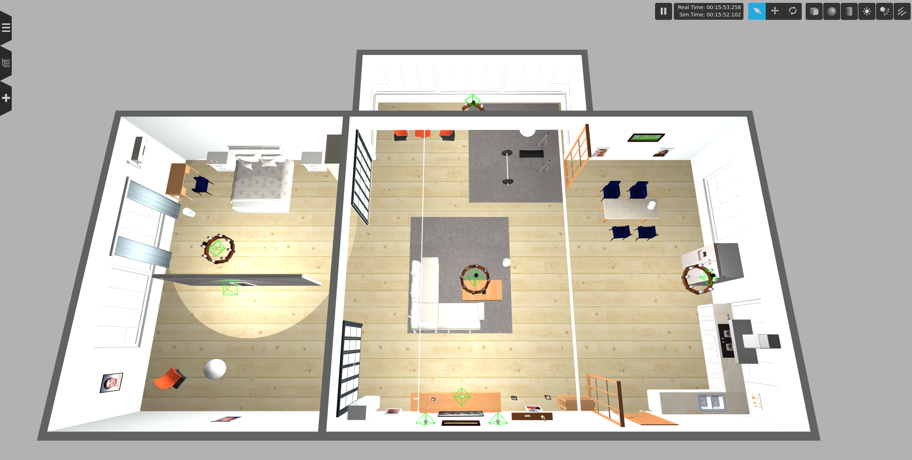
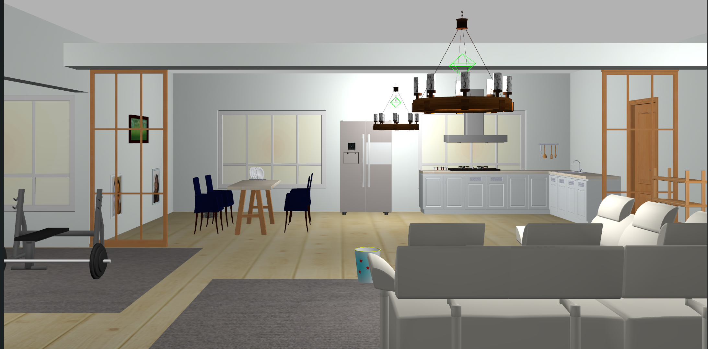
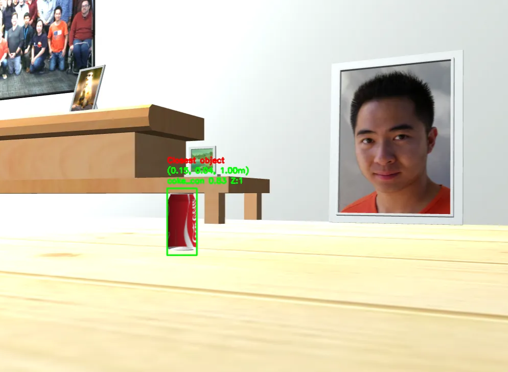
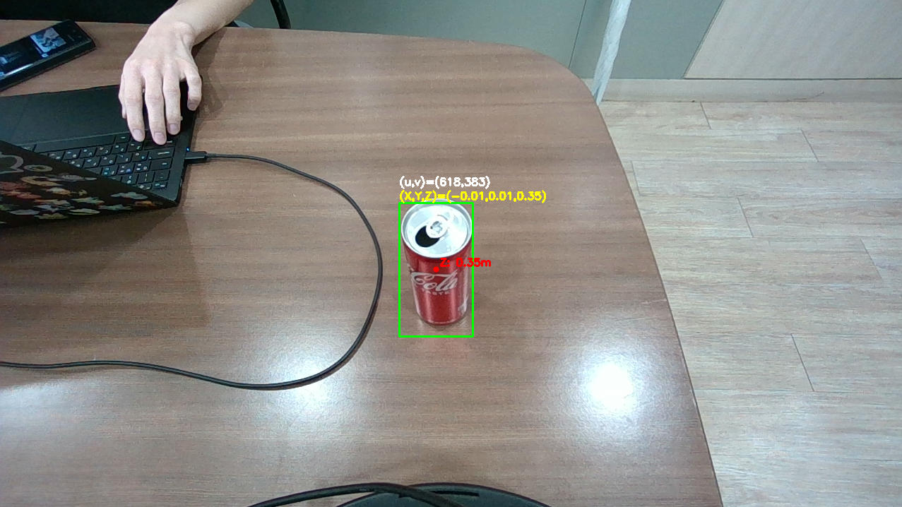
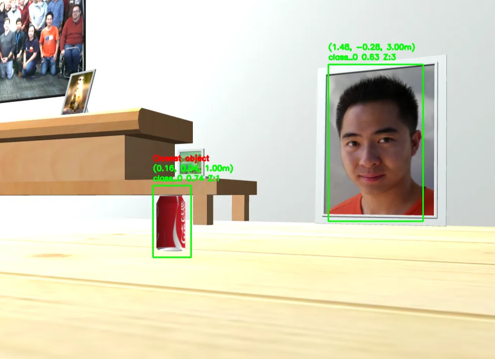
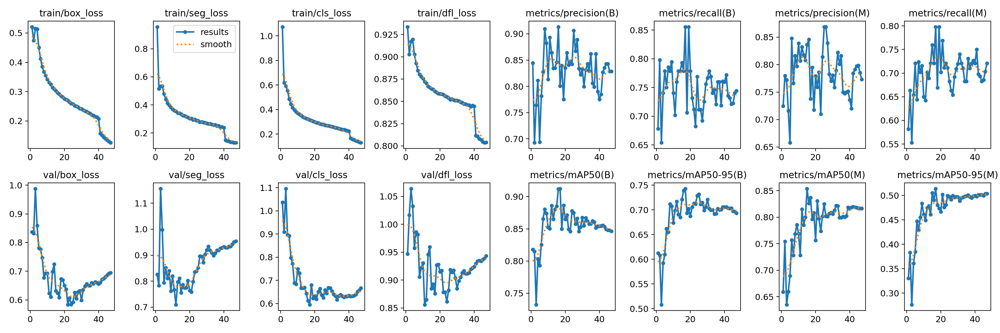
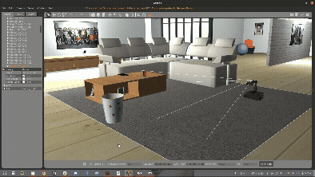

# 🤖 Sim2Real Object-Aware Mobile Manipulator

<p align="center">
  <b>Gazebo → Real World · YOLOv8 · RGB-D · ROS Navigation · TurtleBot3 + OpenManipulator-X</b>
</p>

> **Gazebo 시뮬레이션과 실제 환경에서 객체를 인지하고 3D 위치를 계산하여, 모바일 로봇이 목표 위치까지 이동하도록 구현한 Sim2Real 로봇 프로젝트입니다.**

본 프로젝트는 **Gazebo에서 먼저 객체 인지·좌표 변환·Navigation·Pick & Place 흐름을 검증**한 뒤, 실제 RGB-D 카메라와 모바일 로봇 환경으로 확장했습니다.  
최종 플랫폼은 **TurtleBot3 + OpenManipulator-X** 기반 모바일 매니퓰레이터를 사용했습니다.

<br>

<table align="center">
  <tr>
    <td align="center"><b>Real-World Pick</b></td>
    <td align="center"><b>Gazebo Pick & Place</b></td>
  </tr>
  <tr>
    <td align="center">
      
    </td>
    <td align="center">
      
    </td>
  </tr>
</table>

<br>

---

## 📌 Project Overview

기존 로봇 청소기는 바닥에 놓인 물체를 직접 인지하고 처리하기 어렵다는 점에서 출발했습니다.

프로젝트의 전체 목표는 다음과 같습니다.

```text
자율 주행
   ↓
객체 인지
   ↓
RGB-D 기반 3D 좌표 계산
   ↓
카메라 좌표 → 로봇 좌표 → 월드 좌표 변환
   ↓
객체 위치로 이동
   ↓
Pick
   ↓
쓰레기통 위치로 이동
   ↓
Place
```

현재 GitHub 저장소는 **Perception + Navigation 코드와 학습 모델**을 중심으로 정리했습니다.

> [!NOTE]
> - 로봇팔 제어 코드와 통합 URDF는 현재 저장소에 포함되어 있지 않습니다.
> - 콜라캔 Pick/Place는 프로젝트에서 실험 및 시연했지만, 해당 Manipulation 소스는 본 저장소에 포함하지 않았습니다.
> - 전선(Wire)은 인지 및 위치 추정까지 구현했으며, **전선을 로봇팔로 직접 처리하는 Manipulation은 구현하지 못했습니다.**

---

## ✨ Main Features

| 기능 | Gazebo | Real World | 상태 |
|---|:---:|:---:|---|
| 실내 Simulation 환경 구성 | ✅ | - | 구현 |
| YOLOv8 콜라캔 Detection | ✅ | ✅ | 구현 |
| YOLO 기반 Wire Segmentation | - | ✅ | 구현 |
| RGB-D 기반 3D 좌표 추정 | ✅ | ✅ | 구현 |
| 카메라 → 로봇 좌표 변환 | ✅ | ✅ | 구현 |
| AMCL 기반 월드 좌표 변환 | ✅ | ✅ | 구현 |
| 검출 객체 위치까지 이동 | ✅ | ✅ | 구현 |
| PID 기반 모바일 로봇 제어 | - | ✅ | 구현 |
| 콜라캔 Pick & Place | ✅ | ✅ | Demo 수행 |
| Wire Manipulation | - | ❌ | 미구현 |

---

# 🏠 Gazebo Simulation

## Environment

Simulation 환경은 **AWS RoboMaker Small House World**를 기반으로 구성했습니다.

- World: `small_house`
- Object asset: Coca-Cola can
- Mobile manipulator: TurtleBot3 + OpenManipulator-X

🔗 [AWS RoboMaker Small House World](https://github.com/aws-robotics/aws-robomaker-small-house-world)  
🔗 [ROBOTIS TurtleBot3 Manipulation](https://docs.robotis.com/docs/systems/turtlebot3/manipulation/#simulation)

### Simulation World

<table align="center">
  <tr>
    <td align="center"><b>Top View</b></td>
    <td align="center"><b>Indoor Environment</b></td>
  </tr>
  <tr>
    <td align="center">
      
    </td>
    <td align="center">
      
    </td>
  </tr>
</table>

Gazebo 환경에서는 실제 주거 공간과 유사한 실내 환경을 구성하고, 객체 검출뿐 아니라 RGB-D 정보를 이용한 **3D 좌표 계산 및 로봇 좌표계 변환**을 함께 검증했습니다.

---

# 🧠 Perception

## 1. Coke Can Detection

콜라캔은 직접 구축한 데이터셋으로 YOLOv8 모델을 학습했습니다.

사용 모델:

```text
code/model/best_coke_can_v9.pt
```

### Gazebo Detection

<p align="center">
  
</p>

### Real-World Detection

<p align="center">
  
</p>

실제 환경에서도 Bounding Box와 함께 검출된 객체의 **Depth 및 3D 위치**를 계산했습니다.

---

## 2. Dataset Improvement

초기 데이터셋에서는 배경의 액자와 같은 객체를 콜라캔으로 잘못 인식하는 오검출이 발생했습니다.

<p align="center">
  
</p>

이를 개선하기 위해 다음과 같은 데이터를 추가했습니다.

- 다양한 거리의 콜라캔
- 밝기 변화가 있는 환경
- 실제 사용 위치와 유사한 배경
- 오검출이 발생했던 배경 이미지
- 다양한 시점의 콜라캔 이미지

또한 낮은 Confidence 결과를 제거하기 위해 Detection threshold를 적용했습니다.

---

## 3. RGB-D → 3D Coordinate

Bounding Box 중심 픽셀과 Depth 값을 이용해 카메라 기준 3D 좌표를 계산합니다.

```math
X = (c_x-c_{x0})\frac{Z}{f_x}
```

```math
Y = (c_y-c_{y0})\frac{Z}{f_y}
```

```math
Z = depth
```

Gazebo용 `sim_coke_detection.py`에서는 검출된 객체 중 Depth가 가장 작은 객체를 선택하여 `/3D_closest_coordinate`로 발행합니다.

---

## 4. Camera → Robot → World Coordinate

실제 환경의 Wire 인지 코드에서는 카메라 좌표를 로봇 좌표계로 변환한 뒤, `/amcl_pose`의 로봇 위치와 yaw를 이용하여 월드 좌표를 계산합니다.

```math
X_{world}=X_R+x_{local}\cos\theta-y_{local}\sin\theta
```

```math
Y_{world}=Y_R+x_{local}\sin\theta+y_{local}\cos\theta
```

```text
RGB-D Camera
      ↓
YOLO Detection / Segmentation
      ↓
Pixel + Depth
      ↓
Camera 3D Coordinate
      ↓
Robot Coordinate
      ↓
AMCL Pose
      ↓
World Coordinate
```

---

# 🔌 Wire Detection

실제 환경에서는 **바닥의 전선(Wire)** 을 별도의 YOLO 모델로 학습해 검출했습니다.

사용 모델:

```text
code/model/best_wire.pt
```

Wire 모델은 Segmentation Mask 내부의 Depth 값을 사용하여 객체 위치를 계산하도록 구현했습니다.

### Wire Segmentation & Depth

<p align="center">
  
</p>

Wire Segmentation 결과에서 Mask 내부의 유효 Depth를 탐색하고, 해당 위치를 Camera → Robot → World 좌표계 순으로 변환합니다.

### Pipeline

```text
RGB Image
   ↓
Wire Segmentation
   ↓
Mask 내부 유효 Depth 탐색
   ↓
Camera 3D Coordinate
   ↓
Robot Coordinate
   ↓
World Coordinate
```

<p align="center">
  
</p>

> Wire의 **인지 및 좌표 계산까지 구현**했으며, 이후 로봇팔을 이용해 전선을 집거나 정리하는 동작은 구현하지 않았습니다.

---

# 🗺️ Navigation

`navgation.py`는 `/robot_point`로 목표 좌표를 수신하고 `/amcl_pose`로 현재 위치와 yaw를 확인한 뒤, PID 제어를 통해 로봇을 목표 지점으로 이동시킵니다.

### Navigation Demo

<p align="center">
  
</p>

객체의 월드 좌표를 목표점으로 설정하고 현재 로봇 위치와 목표 방향의 오차를 계산하여 **회전 → 직진 이동** 순으로 목표 위치에 접근하도록 구현했습니다.

```text
/robot_point
     ↓
Target Queue
     ↓
현재 위치 /amcl_pose
     ↓
목표 방향 계산
     ↓
PID Rotation
     ↓
Linear + Angular Control
     ↓
/cmd_vel_mux/input/navi
```

### 주요 ROS Topics

| Topic | 역할 |
|---|---|
| `/amcl_pose` | 로봇의 현재 위치 및 자세 |
| `/robot_point` | 이동할 객체의 월드 좌표 |
| `/cmd_vel_mux/input/navi` | 모바일 로봇 속도 명령 |
| `/3D_closest_coordinate` | Gazebo 카메라 기준 객체 3D 좌표 |
| `/3D_closest_robot_coordinate` | Gazebo에서 변환된 객체 좌표 |
| `/camera_point` | 실제 카메라 기준 Wire 좌표 |
| `/wire_camera_point` | Wire 카메라 기준 좌표 |
| `/wire_robot_point` | Wire 월드 좌표 |
| `/coke_camera_point` | Coke 카메라 기준 좌표 |
| `/coke_robot_point` | Coke 월드 좌표 |

---

# 🔄 Sim2Real

이 프로젝트에서 중요하게 다룬 부분은 동일한 인지·좌표 변환 개념을 **Gazebo와 실제 환경에 각각 적용**한 것입니다.

| | Simulation | Real World |
|---|---|---|
| 환경 | Gazebo Small House | 실제 실내 환경 |
| 카메라 | Gazebo RGB-D Camera | RGB-D Camera |
| 객체 | Coca-Cola Can | Coca-Cola Can / Wire |
| Detection | YOLOv8 | YOLOv8 |
| Localization | AMCL | AMCL |
| Navigation | 객체 좌표 기반 이동 | 객체 좌표 기반 PID 이동 |
| Manipulation | Coke Pick & Place Demo | Coke Pick Demo |
| Wire Manipulation | - | 미구현 |

<p align="center">
  
  
</p>

---

# 🎥 Demo

| Demo | Description |
|---|---|
| [▶ Gazebo Pick & Place](assets/gazebo_pick_place_coke.mp4) | Gazebo에서 콜라캔 Pick & Place |
| [▶ Gazebo Arm Motion](assets/arm_move_coke_gazebo.mp4) | Gazebo 로봇팔 이동 |
| [▶ Gazebo Trash Navigation](assets/gazebo_trash_navgation_demo.webm) | 쓰레기통 방향 Navigation |
| [▶ Real Navigation](assets/real_navgation_demo.mp4) | 실제 모바일 로봇 Navigation |
| [▶ Real Pick](assets/real_pick.mp4) | 실제 환경 콜라캔 Pick |
| [▶ Real Arm Demo](assets/real_arm_demo.mp4) | 실제 OpenManipulator-X 동작 |
| [▶ Gripper Pickup](assets/gripper_pickup_cokecan.mp4) | Gripper 콜라캔 파지 |
| [▶ Wire Detection](assets/wire_detection.webm) | 전선 Segmentation 및 위치 추정 |

---

# 🛠️ Tech Stack

### Robotics


- ROS Noetic
- Gazebo
- RViz
- AMCL
- TurtleBot3
- OpenManipulator-X

### Vision


- Python
- OpenCV
- Ultralytics YOLOv8
- RGB-D / Depth Camera
- NumPy

---

# 🤖 Robot Configuration

최종 시스템은 ROBOTIS의 **TurtleBot3 + OpenManipulator-X** 구성으로 진행했습니다.

```text
        RGB-D Camera
             │
             ▼
     ┌───────────────────┐
     │ OpenManipulator-X │
     └─────────┬─────────┘
               │
        ┌──────▼──────┐
        │  TurtleBot3 │
        └─────────────┘
```

ROBOTIS 공식 문서에서도 OpenManipulator-X를 TurtleBot3 Waffle과 결합한 모바일 매니퓰레이터 구성을 제공하고 있습니다.

---

# 📂 Repository Structure

```text
sim2real/
│
├── README.md
│
├── code/
│   ├── navgation.py
│   ├── sim_coke_detection.py
│   ├── wire_detection.py
│   ├── wire_coke_detection.py
│   │
│   └── model/
│       ├── best_coke_can_v9.pt
│       └── best_wire.pt
│
└── assets/
    ├── coke_detection_real.png
    ├── gazebo_coke_detection.png
    ├── wrong_detection_coke.png
    ├── wire_result.png
    │
    ├── sim_world_top.png
    ├── sim_world.png
    │
    ├── sim_pick.gif
    ├── gazebo_pick_place_coke.gif
    ├── move_trash_navtion.gif
    ├── cut_wire_detection.gif
    │
    ├── gazebo_pick_place_coke.mp4
    ├── gazebo_trash_navgation_demo.webm
    ├── arm_move_coke_gazebo.mp4
    ├── real_navgation_demo.mp4
    ├── real_arm_demo.mp4
    ├── real_pick.mp4
    ├── gripper_pickup_cokecan.mp4
    └── wire_detection.webm
```

---

# 📄 Source Code

| File | Description |
|---|---|
| `sim_coke_detection.py` | Gazebo RGB-D + YOLOv8 콜라캔 Detection 및 3D 좌표 변환 |
| `navgation.py` | `/robot_point` 기반 PID Navigation |
| `wire_detection.py` | Wire Segmentation + Depth + World coordinate |
| `wire_coke_detection.py` | Coke / Wire 동시 인지를 위한 통합 노드 |
| `model/best_coke_can_v9.pt` | 학습한 콜라캔 Detection 모델 |
| `model/best_wire.pt` | 학습한 Wire Segmentation 모델 |

---

# ⚙️ Before Running

현재 모델은 `code/model/`에 정리되어 있으므로 Python 파일의 모델 경로를 아래와 같이 맞추는 것을 권장합니다.

```python
from pathlib import Path
from ultralytics import YOLO

MODEL_DIR = Path(__file__).resolve().parent / "model"

coke_model = YOLO(str(MODEL_DIR / "best_coke_can_v9.pt"))
wire_model = YOLO(str(MODEL_DIR / "best_wire.pt"))
```

특히 현재 소스의 모델 파일명이 서로 다르게 작성되어 있으므로 GitHub 업로드 전에 통일하는 것이 좋습니다.

```text
실제 모델 파일
├── best_coke_can_v9.pt
└── best_wire.pt
```

> `wire_coke_detection.py`가 Segmentation Mask를 기준으로 처리하도록 작성되어 있으므로,  
> `best_coke_can_v9.pt`가 Detection-only 모델이라면 Coke 처리 시 Mask가 없는 경우를 별도로 처리하도록 수정해야 합니다.

---

# 🚧 Limitations

- RGB-D Depth 오차가 최종 객체 위치 오차에 영향을 줄 수 있음
- AMCL Localization 오차가 월드 좌표에 누적될 수 있음
- Gazebo와 실제 카메라의 Intrinsic / Frame 구성이 서로 다름
- 로봇팔 제어 코드와 통합 URDF가 현재 Repository에 포함되어 있지 않음
- Wire는 인지와 좌표 추정까지 진행했으며 Manipulation까지 연결하지 못함
- `wire_coke_detection.py`는 Coke 모델 종류에 따라 Detection/Segmentation 처리 분기가 필요할 수 있음

---

# 📈 Future Work

- Detection / Segmentation 모델 성능 개선
- 객체 위치 추정 정확도 향상
- Navigation과 Manipulation 코드 통합
- Wire 인지 결과와 OpenManipulator-X 연동
- Gazebo와 실제 환경의 좌표계 구조 통일
- End-to-End Object Collection Pipeline 구성

---

# 🔗 References

- [ROBOTIS TurtleBot3 Manipulation](https://docs.robotis.com/docs/systems/turtlebot3/manipulation/#simulation)
- [AWS RoboMaker Small House World](https://github.com/aws-robotics/aws-robomaker-small-house-world)
- [Ultralytics YOLO](https://github.com/ultralytics/ultralytics)

---

## 📌 Summary

> **Gazebo에서 검증한 객체 인지·3D 좌표 변환·Navigation 기술을 실제 모바일 로봇 환경으로 확장하고, 콜라캔과 전선을 대상으로 Sim2Real Perception & Navigation을 구현한 프로젝트입니다.**
